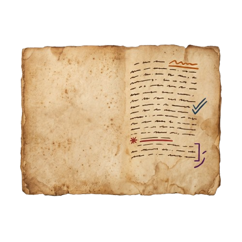
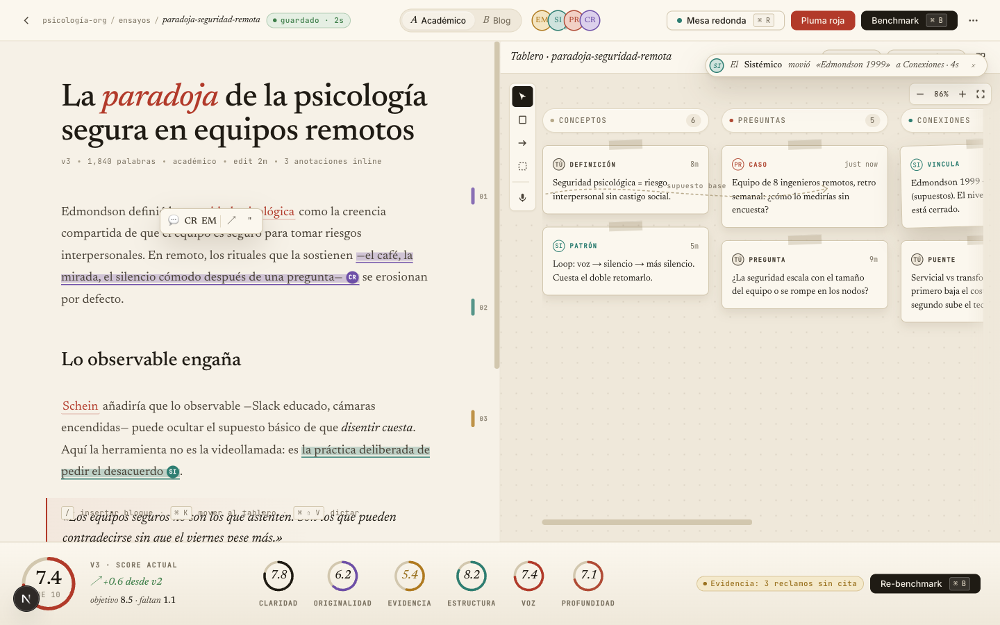
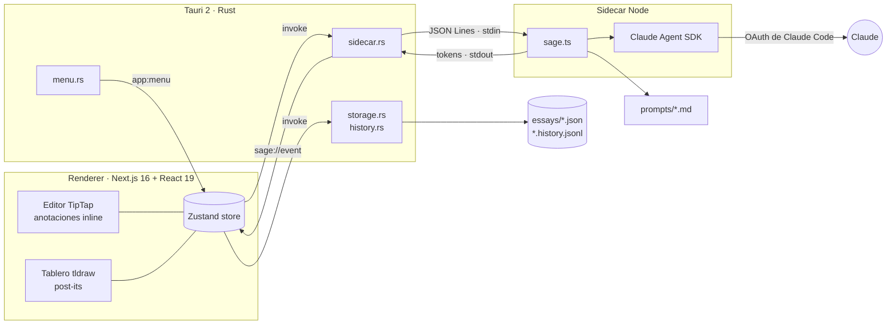

<div align="center">

<!-- TODO: crear docs/banner-dark.png y docs/banner-light.png (1280x640) con la paleta de noeosorio.com (fondo #18181b, acento #bef264 → #10b981) y descomentar
<picture>
  <source media="(prefers-color-scheme: dark)" srcset="docs/banner-dark.png">
  
</picture>
-->



# Essay Studio

**Un consejo de cuatro sabios de IA que interroga, anota y puntúa tus ensayos mientras los escribes.**


[Features](#-features) · [Quickstart](#-quickstart) · [Arquitectura](#️-arquitectura) · [Roadmap](ROADMAP.md)

</div>

Essay Studio es una app de escritorio para escritura aumentada con IA: un editor de texto, un tablero de post-its y cuatro agentes con voces distintas (Empirista, Sistémico, Práctico y Crítico) que te cuestionan a ti en lugar de escribir por ti. Nació para aprender psicología organizacional escribiendo ensayos, con una regla: el puntaje no se le pide al modelo, se calcula a partir de hallazgos concretos que puedes ver, aplicar o descartar.

## ✨ Features

| | Feature | Qué hace |
|---|---|---|
| 🧑‍⚖️ | **Consejo de cuatro sabios** | Cada sabio tiene su persona en [`prompts/`](prompts/): evidencia (EM), sistemas (SI), aplicación (PR) y objeciones (CR). |
| ❓ | **Interrogar** | Los sabios elegidos corren en paralelo sobre un texto o una fuente y hacen 3 preguntas cada uno. Las que marques se convierten en post-its del tablero. |
| 🖍️ | **Evaluar (Pluma Roja)** | Pasadas de coherencia, estilo, argumento y APA 7 (esta última solo en modo académico). El resultado son anotaciones inline sobre el texto, y cada reemplazo se aplica con un click. |
| 📐 | **Rúbrica** | Defines los criterios del profesor con su peso (1 a 5). El consejo los recibe y etiqueta cada hallazgo con su criterio. |
| 📚 | **Fuentes** | Una biblioteca de fuentes por ensayo (`.txt` / `.md`) que se inyecta en cada pasada de Evaluar. |
| 🎯 | **Benchmark determinista** | El puntaje por criterio parte de 10 y baja según la severidad de cada anotación. Un 10/10 significa que el consejo no encontró nada más, y cambia en cuanto editas el ensayo. |
| 🕰️ | **Historial de versiones** | Snapshots automáticos cada 10 min y al cerrar, más guardado manual. Antes de restaurar siempre se guarda una copia de seguridad. |
| 🌐 | **ES / EN por ensayo** | Los sabios te explican en el idioma del ensayo, y cada reemplazo respeta el idioma del fragmento citado. |
| ⌨️ | **Menú nativo con atajos** | Todas las acciones del consejo tienen atajo de teclado (ver abajo). |
| 🔒 | **Local-first, sin API key** | Los ensayos se guardan como JSON en tu máquina. Los sabios usan la sesión OAuth de Claude Code que ya tienes. |

<details>
<summary>Atajos de teclado</summary>

| Atajo | Acción |
|---|---|
| `⌘N` | Nuevo ensayo |
| `⌘W` | Cerrar ensayo |
| `⌘I` | Interrogar (modo consejo) |
| `⌘⇧E` | Evaluar |
| `⌘⇧R` | Rúbrica |
| `⌘⇧F` | Fuentes |
| `⌘⇧⌫` | Limpiar evaluación |
| `⌘⇧H` | Historial de versiones |
| `⌘\` | Mostrar / ocultar tablero |

</details>

## 🖼️ Demo

<!-- TODO: agregar docs/demo.gif (Interrogar → post-its → Evaluar → aplicar reemplazo) y una captura actual de la app -->
<p align="center">
  
</p>

## 🚀 Quickstart

> [!IMPORTANT]
> Para usar a los sabios necesitas tener [Claude Code](https://claude.com/code) instalado y con sesión iniciada en una cuenta **Pro o Max**. El sidecar reutiliza esas credenciales (Keychain de macOS) y consume el crédito mensual del Agent SDK de tu plan. No usa `ANTHROPIC_API_KEY`.

**Requisitos**

- Node 20+ y npm 10+
- Rust 1.88+ (`rustup update stable`)
- Dependencias nativas de Tauri: en macOS, `xcode-select --install`. Para otros sistemas, ver los [prerequisitos de Tauri](https://v2.tauri.app/start/prerequisites/).

```bash
git clone https://github.com/NoeOsorio/essay-studio.git && cd essay-studio
npm install
npm run sidecar:install     # deps del sidecar (Claude Agent SDK)
npm run sidecar:build       # compila sidecar/dist/sage.js
npm run tauri:dev           # Next + ventana Tauri + sidecar
```

> [!NOTE]
> La primera vez, `tauri:dev` compila ~470 crates y tarda de 5 a 10 minutos. Las siguientes corridas tardan segundos. Si ya tienes `next dev` corriendo en `:3000`, detenlo antes.

**Build distribuible**

```bash
npm run tauri:build:full    # recompila el sidecar y luego empaqueta
```

El bundle queda en `src-tauri/target/release/bundle/` (`.app` / `.dmg` en macOS, `.msi` en Windows, `.deb` / `.AppImage` en Linux). Para abrir el `.app` hacen falta Node 20+ y Claude Code con sesión iniciada. Si falta alguno, la app lo avisa con un banner, y el editor y el tablero siguen funcionando.

<details>
<summary>Todos los scripts</summary>

| Script | Qué hace |
|---|---|
| `npm run dev` | Solo Next en `http://localhost:3000` (sin Tauri: persistencia y sabios desactivados). Útil para iterar estilos. |
| `npm run build` | Export estático de Next a `./out` |
| `npm run lint` | ESLint |
| `npm run test:e2e` | Suite Playwright headless |
| `npm run test:e2e:ui` | Suite Playwright con UI interactiva |
| `npm run sidecar:install` | Instala deps del sidecar |
| `npm run sidecar:build` | Compila el sidecar a `sidecar/dist/sage.js` |
| `npm run tauri:dev` | App completa en modo desarrollo |
| `npm run tauri:build` | Empaqueta usando el sidecar ya compilado |
| `npm run tauri:build:full` | Compila el sidecar y empaqueta (recomendado para release) |
| `npm run tauri` | CLI de Tauri, p. ej. `npm run tauri -- icon branding/logo-1024.png` |

</details>

**Tests**: 110 specs E2E con Playwright (el sidecar está stubbed, así que no consumen créditos) y 33 tests de Rust.

```bash
npm run test:e2e
cargo test --manifest-path src-tauri/Cargo.toml
```

## ⚙️ Configuración

No hace falta `.env`. Estas variables opcionales sirven como override para setups poco comunes:

| Variable | Para qué sirve |
|---|---|
| `SAGE_NODE_PATH` | Ruta explícita al binario de Node que usará el sidecar |
| `SAGE_SIDECAR_PATH` | Ruta a `sage.js` si no está en el bundle ni en el repo |
| `SAGE_PROMPTS_DIR` | Carpeta con las personas `.md` de los sabios |

<details>
<summary>Cómo encuentra Node el <code>.app</code></summary>

Las apps que abres desde Finder o el Dock no heredan el `PATH` de tu shell, así que un Node instalado con nvm, fnm o volta no aparece a simple vista. Rust lo busca en este orden:

1. `SAGE_NODE_PATH`
2. El `PATH` del proceso (cubre `tauri:dev` y `open` desde la terminal)
3. Ubicaciones conocidas: Homebrew, volta, asdf, `/usr/bin` y la versión más alta que haya en nvm/fnm
4. Tu login shell (`$SHELL -lc 'command -v node'`)

Los datos viven en `~/Library/Application Support/com.noeosorio.essaystudio/essays/`, con un `<id>.json` y un `<id>.history.jsonl` por cada ensayo.

</details>

## 🏗️ Arquitectura



- **El renderer no tiene acceso crudo al filesystem.** Toda la I/O pasa por comandos Rust con escritura atómica (tmp + rename).
- **Los sabios corren en un proceso Node aparte** que habla con Rust por JSON Lines, así que el streaming token a token funciona sin abrir puertos.
- **El modelo devuelve citas literales y el frontend las ancla al documento.** Así nadie tiene que calcular offsets de ProseMirror, y las anotaciones viajan dentro del propio documento como marks de TipTap.

## 📁 Estructura

<details>
<summary>Ver estructura</summary>

```text
essay-studio/
├── src/
│   ├── app/                 # layout, page, tokens de diseño (globals.css)
│   ├── components/
│   │   ├── editor/          # TipTap + mark Annotation + popover + slash menu
│   │   ├── canvas/          # tldraw con NoteShapeUtil propio (post-its Pergamino)
│   │   ├── lectura/         # overlays: Interrogar, Evaluar, Rúbrica, Fuentes, Historial
│   │   ├── council/         # avatares del consejo
│   │   └── ui/              # primitivos propios (sin librerías de componentes)
│   └── lib/
│       ├── agents/          # interrogate, critique, parseo de anotaciones
│       ├── benchmark/       # score determinista
│       ├── storage/         # wrappers de invoke + tipos
│       └── store.ts         # Zustand
├── src-tauri/src/           # storage, history, sidecar, menu
├── sidecar/src/sage.ts      # protocolo JSON Lines + Claude Agent SDK
├── prompts/                 # personas de los cuatro sabios
├── tests/e2e/               # Playwright con Tauri stubbed
└── branding/                # logo fuente (npx tauri icon branding/logo-1024.png)
```

</details>

## 🗺️ Roadmap

El detalle está en [`ROADMAP.md`](ROADMAP.md).

- [x] Build distribuible con sidecar y prompts empacados
- [x] Historial de versiones con restauración segura
- [x] Menú nativo con atajos para todo el consejo
- [ ] Export a Markdown con anotaciones
- [ ] Auto-respawn del sidecar e indicador de salud
- [ ] Abrir el último ensayo al iniciar
- [ ] Backup automático y export a ZIP
- [ ] PDF y Word como tipo de fuente

## 📄 Licencia

Distribuido bajo licencia MIT. Ver [`LICENSE`](LICENSE).

---

<div align="center">

Hecho con ☕ por [Noé Osorio](https://noeosorio.com) · [business@noeosorio.com](mailto:business@noeosorio.com)

</div>
